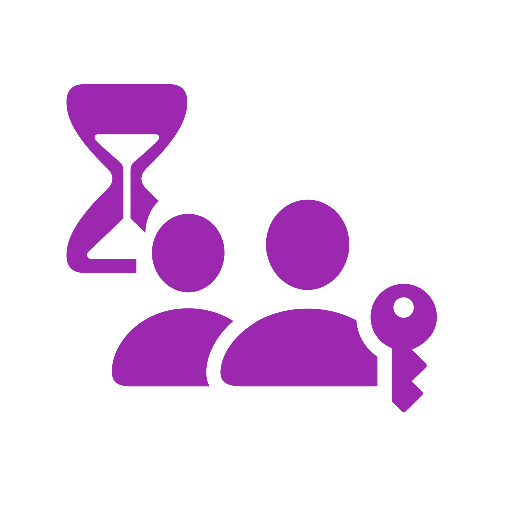

<p align="center">
  
</p>

<h1 align="center"><a href="https://github.com/mnbf9rca/family-foqos">Family Foqos</a></h1>

<p align="center">
  <strong>Focus, the physical way</strong>
</p>

<p align="center">
  Foqos helps you put your most distracting apps behind a quick tap — using NFC tags or QR codes — so you can stay in the zone and build better digital habits. It’s free, open source, and an alternative to Brick, Bloom, Unpluq, Blok, and more.
</p>

---

## ✨ Features

Family Foqos adds:

- **👨‍👩‍👧 Parent Mode**: Parental control over changing settings — lock profiles for your children
- **👶 Child Mode**: Kids can create and use profiles freely — parents can choose to lock specific profiles
- **☁️ Shared Lock Codes**: Sync parent lock codes across your family's devices via iCloud

But still has all these features from the original Foqos app:

- **🏷️ NFC & QR Blocking**: Start or stop sessions with a quick tag tap or QR scan
- **🧩 Start Triggers & Stop Conditions**: Mix and match how each profile *starts* (manual, NFC, QR, schedule, deep link) and how it *stops* (manual, timer, NFC, QR, schedule, deep link) — no fixed "strategy" to pick
- **⏱️ Timer-Based Blocking**: Block for a set duration, then unblock with NFC or QR
- **🔐 Physical Unblock**: Optionally require a specific tag or code to stop
- **📱 Profiles for Life**: Create profiles for work, study, sleep — whatever you need
- **📊 Habit Tracking**: See your focus streaks and session history at a glance
- **⏸️ Smart Breaks**: Take a breather without stopping your session
- **🌐 Website Blocking**: Block distracting websites in addition to apps
- **🔄 Live Activities**: Real-time status on your Lock Screen

## 📋 Requirements

- iOS 18.6+
- iPhone with NFC capability (for NFC features)
- Screen Time permissions (for app blocking)

## 🚀 Getting Started

### From the App Store

1. Family Foqos is not yet published on the App Store — build it from source (see the Development section below)
2. Grant Screen Time permissions when prompted
3. Create your first blocking profile
4. Optionally set up NFC tags or a QR code and start focusing

### Adding Family Lock

1. Install the app on a Parent device
2. Set up a lock code in Settings
3. Install the app on a Child device, and create some profiles
3. Invite a child account and accept it from the Child device
4. Select which profiles should be locked from the Profile settings

> **Note:** Profile locking only works on Apple Family child accounts — this prevents misuse in coercive relationships and i'm not going to change that feature.

### Setting Up NFC Tags

1. Grab a few NFC tags (NTAG213 or similar works great)
2. Create a profile in Foqos
3. Write the tag from within the app
4. Stick tags where they make sense (desk, study spot, bedside)
5. Tap to start or stop a session

## 🛠️ Development

### Prerequisites

- Xcode 16.0+
- iOS 18.6+ SDK
- Swift 6.0
- Apple Developer Account (for Screen Time and NFC entitlements)

### Building the Project

```bash
git clone https://github.com/mnbf9rca/family-foqos.git
cd family-foqos
open FamilyFoqos.xcodeproj
```

### Project Structure

```
family-foqos/
├── Foqos/                     # Main app target
│   ├── Views/                 # SwiftUI views
│   ├── Models/                # Data models
│   │   └── Strategies/        # Blocking strategies
│   ├── Components/            # Reusable UI components
│   ├── Utils/                 # Utility functions
│   └── Intents/               # App Intents & Shortcuts
├── FoqosWidget/               # Widget extension
├── FoqosDeviceMonitor/        # Device monitoring extension
└── FoqosShieldConfig/         # Shield configuration extension
```

### Key Technologies Used

- **SwiftUI** — Modern, declarative UI
- **SwiftData** — Local persistence
- **Family Controls** — App blocking
- **Core NFC** — Tag reading/writing
- **CodeScanner** — QR scanning
- **BackgroundTasks** — Background processing
- **Live Activities** — Dynamic Island + Lock Screen updates
- **WidgetKit** — Home Screen widgets
- **App Intents** — Shortcuts and automation

## 🔒 Start Triggers & Stop Conditions

A profile in Family Foqos (schema v2) is configured by two independent value types — **how it
starts** and **how it stops** — rather than by picking a single "strategy". Both are stored as
JSON on the profile (`startTriggersData` / `stopConditionsData` in
`Foqos/Models/BlockedProfiles.swift`) and surfaced through the computed `startTriggers` /
`stopConditions` properties.

### Start triggers (`Foqos/Models/ProfileStartTriggers.swift`)

Any combination of:

- `manual` — start from within the app
- `anyNFC` — start by scanning any NFC tag
- `specificNFC` — start only by scanning the tag stored in `startNFCTagId`
- `anyQR` — start by scanning any QR code
- `specificQR` — start only by scanning the code stored in `startQRCodeId`
- `schedule` — start automatically on the profile's schedule
- `deepLink` — start via the profile's deep link (see below)

Helpers: `hasNFC` (any NFC start), `hasQR` (any QR start), `isValid` (at least one trigger set).

### Stop conditions (`Packages/FoqosShared/Sources/FoqosShared/ProfileStopConditions.swift`)

Any combination of:

- `manual` — stop from within the app
- `timer` — stop automatically after a chosen duration
- `anyNFC` — stop by scanning any NFC tag
- `sameNFC` — stop only by scanning the same tag that started the session
- `specificNFC` — stop only by scanning the tag stored in `stopNFCTagId`
- `anyQR` / `sameQR` / `specificQR` — the QR-code equivalents (`stopQRCodeId` holds the specific code)
- `schedule` — stop automatically on the profile's schedule
- `deepLink` — stop via the profile's deep link

Helpers: `isValid`, `hasNFC`, `hasQR`, `requiresPhysicalItemOnly` (true when the only way to stop
is a physical tag/code — used to warn the user before they start).

The specific-item IDs `startNFCTagId` / `startQRCodeId` / `stopNFCTagId` / `stopQRCodeId`
supersede the legacy `physicalUnblockNFCTagId` / `physicalUnblockQRCodeId` fields.

> **Legacy V1 strategy classes.** The classes in `Foqos/Models/Strategies/` (`NFCBlockingStrategy`,
> `QRCodeBlockingStrategy`, `ManualBlockingStrategy`, `NFCManualBlockingStrategy`,
> `QRManualBlockingStrategy`, `NFCTimerBlockingStrategy`, `QRTimerBlockingStrategy`, …) and the
> `physicalUnblock*` fields exist **only** to execute unmigrated V1 profiles and to sync with V1
> devices; V1 profiles are resolved to start/stop actions via
> `Foqos/Utils/StartStopActionResolver.swift`. V2 profiles carry `profileSchemaVersion == 2` and
> leave `blockingStrategyId` unset — there is no strategy-picker UI. (Removal of the legacy
> `blockingStrategyId` system is tracked in #59.)

### QR deep links

- Each profile exposes a deep link via `BlockedProfiles.getProfileDeepLink(profile)` in the form:
  - `https://family-foqos.app/profile/<PROFILE_UUID>`
- Scanning a QR that encodes this deep link will toggle the profile: if inactive it starts, if active it stops. This works even if the app isn’t already open (it will be launched via the link).

## 🤝 Contributing

We love contributions! Here’s how to jump in:

1. **Fork the repository**
2. **Make your changes** and test them out
3. **Commit your changes** (`git commit -m 'Add amazing feature'`)
4. **Open a Pull Request**

### Contribution Guidelines

- Follow Swift coding conventions
- Update documentation as needed
- Test on multiple iOS versions when possible

## 🐛 Issues & Support

Something not working as expected? We're here to help.

- **Bug Reports**: [Open an issue](https://github.com/mnbf9rca/family-foqos/issues) with detailed steps to reproduce
- **Feature Requests**: Share your ideas via [GitHub Issues](https://github.com/mnbf9rca/family-foqos/issues)

When reporting issues, please include:

- iOS version
- Device model
- Steps to reproduce
- Expected vs actual behavior
- Screenshots if applicable
- **Debug output** (needed for diagnosing issues):
  1. Start an active profile
  2. Scroll to the bottom and tap "Debug Mode"
  3. Tap the copy button on the right-hand side
  4. Paste the output in your issue report

## 📄 License

This project is licensed under the MIT License - see the [LICENSE](LICENSE) file for details. This project is a fork of the MIT Licenced [Foqos app](https://github.com/awaseem/foqos).

## 🔗 Links

- App Store — not yet published (build from source via the GitHub repo above)
- [GitHub Issues](https://github.com/mnbf9rca/family-foqos/issues)
- [Donate to Common Sense Media](https://www.commonsensemedia.org/donate)

---

<p align="center">
  Made with ❤️ by <a href="https://github.com/awaseem">Ali Waseem</a>
</p>
